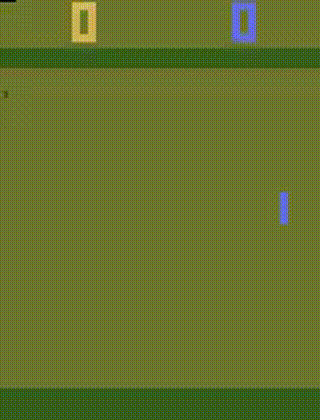

# Pong-DQN

Implementation of the Deep Q-Learning Network(DQN) to play the atari Pong from OpenAI Gymnasium environment.

# Demo

# Problem Statement

The Atari Pong environment consists of two paddles and a ball.The agent controls the green paddle on the right and the brown paddle is controlled by the built in Computer AI. The objective is to score points by getting the bass past the opponent's paddle. Each succesful score yields 1 point to scoring player. A match ends when either of them reaches 21 points, and the first one to do so is the winner.

The environment provides raw RGB images of size 210 x 160 pixels. This is what we see or a human player see. For training they are processed by :
* Grayscale Conversion to reduce computional complexity.
* Cropping 34 pixels from top and 16 pixels from bottom to focus on the gamefield and to remove unnecessary areas like score display (results in 160 x 160 pixels)
* Resizing to 84 x 84 pixels for efficieny.
* Frame Stack: 4 continuous frames are stacked together to capture temporal dynamics and to find out ball velocity and direction.

# Description

For the problems involving high dimensional state space(image inputs) and small discrete action space, Deep Q-Networks(DQN) and their variants (e.g., Double DQN) provide effective solutions. These methods are designed to learn policies from images(pixel data) and select the actions that maximize the long term rewards. Reinforcement Learning, grounded in Markov Desicion Processes (MDPs), involves an agent interacting with the environment to optimize the cumulative rewards. DQNs solves the challenge of large state spaces by utilizing Deep Neural Networks to approximate Q-values, which quantify the quality of actions in a given state.

DQN are represented by a Convolutional Neural Network (CNN). The models involves two networks with same architecture:
* Online (Main) Network : Continuously updates weights during training to estimate Q-values.
* Target Network : Frozen parameters periodically syncronized with online network to stabilize learning.

Training an off polict method with bootstrapping and non-linear function approximation can cause instability or divergence. THe target network helps in this by providing stable target Q-values.This approach helps the agent to learn effectively with high dimensional environments like Pong.

<h1>Remaining Laterrrrrrrrrrrr</h1>